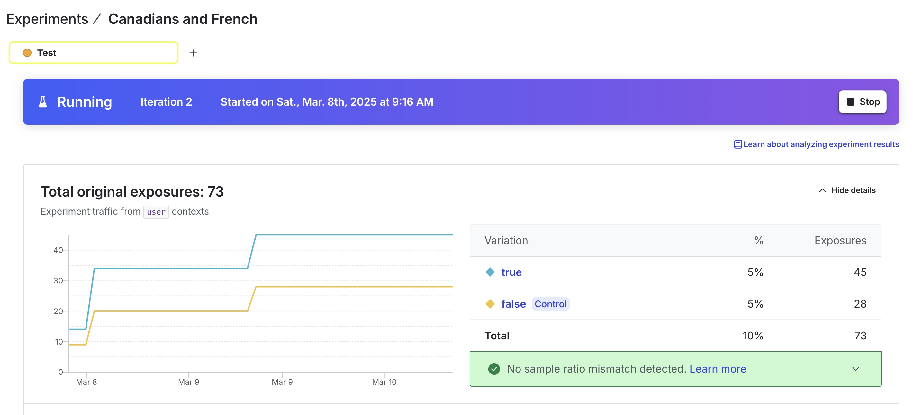

# LaunchDarkly Demo

This is a stand-alone front-end application that demonstrates the functionality and value of LaunchDarkly's feature flags and experiments.

## But first, a couple of notes...

When you read the word "we" throughout this write-up, it's referring to a hypothetical team in a hypothetical ecom company to make the hypothetical scenario slightly more relatable. The code in the repo was written entirely by myself.

There is a call to the LaunchDarkly REST API from this application. To be clear, making REST API calls to LanchDarkly from client-side code is not advisable. This is strictly for demonstration purposes.

## What to Expect

The application is a mock ecommerce website with a few products displayed. There are three features that are controlled by feature flags:

### Blinking Title

[Blinking Title](https://app.launchdarkly.com/projects/default/flags/blinking-title/targeting?env=test&selected-env=test) is a simple boolean feature flag targeted at all users. When targeting is turned on (serving `true`) the main title for the site will blink. Of course this might turn users away. We might see metrics moving in the wrong direction like slumping sales or elevated error rates (as savvy users of the site try to attack us to avenge such UX savagery). To limit the blast radius we installed an automated circuit breaker to turn targeting off and mitigate the pain. This can be simulated by clicking the button in the Control Panel labeled "Oh no! (rollback)".

If you're setting up this feature flag for yourself, here's the general representation:

```        
  "key": "blinking-title",
  "kind": "boolean",
  "name": "Blinking Title",
  "tags": [],
  "temporary": true,
  "variations": [
      {
          "value": true
      },
      {
          "value": false
      }
  ]
```


### Tester

Being that April Fool's Day is coming up, the staff has decided that it would be great to play a little prank on the boss by putting a baby picture of him front and center on the website. This is a super secret mission that absolutely must work in production without anyone knowing about it before the big reveal. We set up a feature flag that only allows the user with ID `prodTester` (selectable in the demo's Control Panel) to see the feature in production. The feature flag's name is [Tester](https://app.launchdarkly.com/projects/default/flags/tester/targeting?env=test&selected-env=test).

If you're setting up this feature flag for yourself, here's the general representation:

```
  "key": "tester",
  "kind": "boolean",
  "name": "Tester",
  "tags": [],
  "temporary": true,
  "variations": [
      {
          "value": true
      },
      {
          "value": false
      }
  ]
```

## Targeted

We have a hunch that many Canadians will make more purchases if the site content is presented in French, so we created a feature flag called [Targeted](https://app.launchdarkly.com/projects/default/flags/targeted/targeting?env=test&selected-env=test) that targets Canadians as a segment. When a user is identified as Canadian, we have the option to toggle site content to French. We then track purchases with a [metric](https://app.launchdarkly.com/projects/default/metrics/purchase-clicked/details?env=test&selected-env=test) triggered by the "Buy Now" button. Since this was a pretty big change for us with a user segment that we don't know much about, we decided to test our way into the functionality to see if it created any lift in sales. We created an associated experiment called [Canadians and French](https://app.launchdarkly.com/projects/default/experiments/canadians-and-french/results?env=test&selected-env=test). 

My free account ran out of experimentation events (as far as I can tell...2805/0) before the experiment reached statistical significance, but here's a quick shot of what that looked like when the errors started flowing in:



If you're setting up this feature flag for yourself, here's the general representation:

```
  "key": "tester",
  "kind": "boolean",
  "name": "Tester",
  "tags": [],
  "temporary": true,
  "variations": [
      {
          "value": true
      },
      {
          "value": false
      }
  ]
```

## Targeted

We have a hunch that many Canadians will make more purchases if the site content is presented in French, so we created a feature flag called [Targeted](https://app.launchdarkly.com/projects/default/flags/targeted/targeting?env=test&selected-env=test) that targets Canadians as a segment. When a user is identified as Canadian, we have the option to toggle site content to French. We then track purchases with a [metric](https://app.launchdarkly.com/projects/default/metrics/purchase-clicked/details?env=test&selected-env=test) triggered by the "Buy Now" button. Since this was a pretty big change for us with a user segment that we don't know much about, we decided to test our way into the functionality to see if it created any lift in sales. We created an associated experiment called [Canadians and French](https://app.launchdarkly.com/projects/default/experiments/canadians-and-french/results?env=test&selected-env=test). 

My free account ran out of experimentation events (as far as I can tell...2805/0) before the experiment reached statistical significance, but here's a quick shot of what that looked like when the errors started flowing in:


If you're setting up this feature flag for yourself, here's the general representation:

```
  "key": "targeted",
  "kind": "boolean",
  "name": "Targeted",
  "tags": [],
  "temporary": true,
  "variations": [
      {
          "value": true
      },
      {
          "value": false
      }
  ]
```

You'll also need to set up a segment:

```
{
  "name": "Canadians",
  "tags": [],
  "key": "canadians",
  "included": [],
  "excluded": [],
  "includedContexts": [],
  "excludedContexts": [],
  "rules": [
      {
          "_id": "0f656627-faee-440d-923b-f99c0ba6fd20",
          "clauses": [
              {
                  "_id": "15509065-6c6e-4f21-aaa4-21ba0e38e662",
                  "attribute": "location",
                  "op": "in",
                  "values": [
                      "CA"
                  ],
                  "contextKind": "user",
                  "negate": false
              }
          ],
          "rolloutContextKind": "user"
      }
  ]
}
```

## How to Run This App

This [React](https://react.dev/) application was created using [Vite](https://vite.dev/) and uses [Yarn](https://yarnpkg.com/) for dependency management (if you like). Once you cloned the repo, here's how to run it:

1. Install dependencies: `yarn install`.
2. Create a `.env` file in which you will set two key environment variables: `VITE_LD_KEY` and `VITE_LD_TOKEN`. These are the client key and API key respectively. They are needed for this demo. The values are purposefully not in this repo. Please contact me for valid values.
3. Start the app: `yarn dev`.
4. Open a browser and navigate to [localhost:5173](http://localhost:5173/).

Once you're up and running, you can toggle feature flags in the LaunchDarkly UI and see them change in real-time in the app. You can also change up the user context using the control panel in the lower left corner of the browser. 

If you want to run the automation for demonstrating experimentation (more on that below), you'll need to install Gecko Driver for Selenium testing in Firefox:

1. Navigate to [https://github.com/mozilla/geckodriver/releases](https://github.com/mozilla/geckodriver/releases)
2. Download the package for your OS
3. Unzip the package
4. Open a terminal and run the driver: `$ ~/Downloads/geckodriver\ 2`

To run the automation, open up two terminals. In one run `yarn dev`. Then you can `yarn test` in the other terminal.

## Details

**Components**

The `FlagEvaluator` component does the bulk of the work. It takes two properties:

1. `flagKey`: Exactly what it sounds like...It's the string value that LaunchDarkly recognizes to evaluate a feature flag.
2. `flagValueMap`: This property is an object gives us the ability to associate whatever content we want to render with whatever flag value should show that content. The keys of this object should correspond to the potential values of the feature flag. If the flag is boolean, the map will have two keys, `true` and `false`. If it's a string-based feature flag, use the string values. The values of this object should be any render-able content or component.

The `ErrorButton` and `PurchaseButton` components are instrumented to send events to LaunchDarkly. The `PurchaseButton` in particular sends events that are tied back to the experiment demonstration.

_Wait...What about that `ErrorButton`?_

This was plugged in as another way to observe events other than the afore-mentioned purchase event flowing into LaunchDarkly. The idea is that we could use this to explore things like automated rollbacks based on error thresholds. I didn't take it quite that far.

**Experiment Automation**

In order to gather enough data for the experiment demonstrated, I created a test that uses Selenium to loop through rendering the app with unique users and randomly clicking the purchase button. To fake the idea of user identity, the app allows us to pass in a `user` and `location` on the query string. In this way we don't need to worry as much about finding and clicking elements in the Selenium code, and it gives us the ability to generate as many user IDs as we want.

**Lesson Learned**

When running the experiment the first time, I ran into an issue with sample ratio mismatch. This turned out to be an issue with the order of operations of identifying the user and evaluating the pertinent flag. I ended up changing a couple of things in the process:

1. I made the default value for the `user` and `location` state values come directly from the query string rather than start as `null` and then being set by `useEffect`.
2. I added a state value called `initialId` that would delay rendering the application until the after the first `identify` call has completed.
